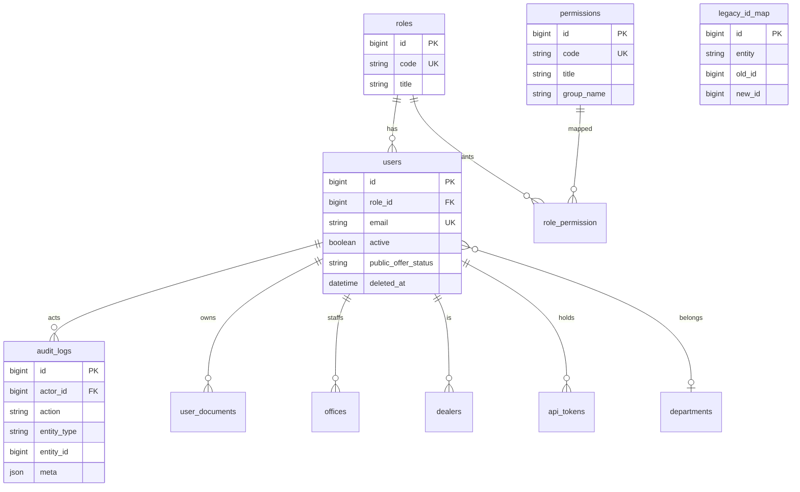

# ERD: Identity

Роли: `admin`, `management`, `master`, `finance`, `logist`, `office`, `dealer`, `sub_user`, `support`, `buyer`, `seller`, `looking`, `lead_generation`.

Права — коды `*.read|create|update|delete` по доменам + меню. `admin` и `management` проходят все Policies.
